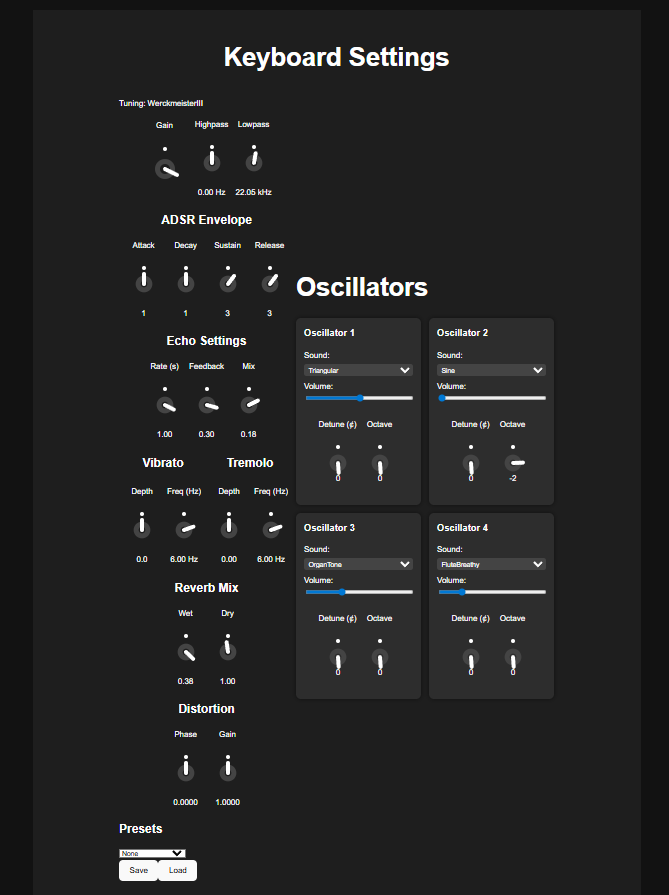

# Keyboard synth

A little experimentation with OpenAL and audio signal processing in general led me to this
project idea. Play music with the computer keyboard.


# Build

Clone the source tree and build using CMake

```bash
git clone https://github.com/Ricardicus/keyboard-synth.git
cd keyboard-synth
mkdir build
cmake -B build
cmake --build build
```

# Run 

```
# For openAL based keyboard
./build/keyboard
# For streaming based keyboard (more features)
# requires SDL2 installed
./build/keyboardstream
```

Now you can press the keys on the a -> l and z -> , keys. Sharp notes: w, e, t, y, u. 
Change octaves with o (down) and p (up). Echo effect added with argument -e.
Use -h or --help for more info.

In general, for more help use -h:

```text
./build/keyboard -h
Usage: ./build/keyboard [flags]
flags:
   -p|--port [int]: Port to host synth config tool on
                    per default 8080, http://localhost:8080
   -e|--echo: Add an echo effect
   --reverb: Add a synthetic reverb effect
   --chorus: Add a chorus effect with default settings
   --chorus_delay [float]: Set the chorus delay factor, default: 0.45
   --chorus_depth [float]: Set the chorus depth factor, in pitch cents, default: 3
   --chorus_voices[int]: Set the chorus voices, default: 3
   --vibrato: Add a vibrato effect with default settings
   --vibrato_depth [float]: Set the vibrato depth factor, default: 0.3
   --vibrato_frequency [float]: Set the vibrato frequency, in Hertz  default: 6
   --tremolo: Add a tremolo effect with default settings
   --tremolo_depth [float]: Set the tremolo depth factor [0-1], default: 1.0
   --tremolo_frequency [float]: Set the tremolo frequency, in Hertz  default: 18
   --notes [file]: Map notes to .wav files as mapped in this .json file
   --midi [file]: Play this MIDI (.mid) file
   --volume [float]: Set the volume knob (default 1.0)
   --duration [float]: Note ADSR quanta duration in seconds (default 0.1)
   --adsr [int,int,int,int]: Set the ADSR quant intervals comma-separated (default 1,1,3,3)
   --sustain [float]: Set the sustain level [0,1] (default 0.8)
   --lowpass [float]: Set the lowpass filter cut off frequency in Hz
                   (default no low pass)
   --highpass [float]: Set the highpass filter cut off frequency in Hz
                (default no highpass)
   --parallelization [int]: Number of threads used in keyboard preparation default: 8
   --tuning [string]: Set the tuning used (equal | werckmeister3)

./build/keyboardstream compiled Aug 21 2025 21:00:39
```

## Map keys to wave files

```bash
./build/keyboard --notes media/notes.json
```

Inspect the media/notes.json file to see how it is structured.
I have included already sounds from a piano found at https://theremin.music.uiowa.edu/MISpiano.html
by the University of Iowa. 

## Map IR to wave files

Include your own impulse responses to create reverb effects.
I have included the impulse response from Kalvträsks kyrka (church in Sweden) uploaded by
someone named Lars here: https://familjenpalo.se/vpo/kalvtrask/ .

You can test this reverb on the piano like this:

```bash
./build/keyboard --notes media/notes.json --reverb media/ir/KalvtraskStereo16bps-44100.wav
```

## Play MIDI files

Instead of taking input from the keyboard, the keyboard can also be configured to
receive input events from MIDI files.

This in ebabled with the support of the [midifile project](https://github.com/craigsapp/midifile).
I have included an example midi-file of Bach under media/midi/bmv988.mid
taken from the [jsbash.net webpage](http://www.jsbach.net/midi/midi_goldbergvariations.html)

```bash
./build/keyboard --midi media/midi/bwv988.mid
```

# Dependencies

You need OpenAL and ncurses installed.

```bash
# On OSX
brew install openal-soft
brew install ncurses
# On Debiand
sudo apt-get install libopenal-dev
sudo apt-get install libncurses5-dev
```

# Streamed audio engine synth

All of the above is true for the OpenAL implementation. I am now, working on the streaming based implementation.
To me, this has become the most intreseting aspect yet- and the streaming based keyboard now has more features
than the pre allocated buffer (OpenAL) implementation. It does rely on SDL2 and will only be built if that library
has been installed on ones system.
I want to test audio libraries that properly support streaming (using timed callbacks) and
have ventured into the SDL2 waters with that. I am also building a front end, where one can set
the sound of the keyboard with the browser. All of this is buildable only if one has SDL2 installed.
The program in question is "keyboardstream". Build like above, launch "./build/keyboardstream" and then visit localhost:8080 to edit the sounds and stuff. I have not added support for reverb and such there yet.. It is different when only parts of the sound are generated in real time. 

### SDL 2 as audio engine 

I am now working on a keyboard that is streaming-based. The OpenAL implementation is relying on pre-allocated buffers
associated with each keypress. In my streaming-based keyboard, I instead fill a buffer with a hard time constraint in SDL2 making each sound generated live as the keys are pressed. This makes it easy to implement such things as filters and echos. The Reverb must be treated differenly, as the impulse response is larger than the time constraint. There are methods for that, I might implement it because I am curious. To launch the streaming keyboard, run:

```
# Needs SDL2 installed, additional requirements than the ./build/keyboard
# and is built conditionally if those requirements are fulfilled.
$ ./build/keyboardstream -h
Usage: ./build/keyboardstream [flags]
flags:
   -p|--port [int]: Port to host synth config tool on
                    per default 8080, http://localhost:8080
   -e|--echo: Add an echo effect
   --reverb: Add a synthetic reverb effect
   --chorus: Add a chorus effect with default settings
   --chorus_delay [float]: Set the chorus delay factor, default: 0.45
   --chorus_depth [float]: Set the chorus depth factor, in pitch cents, default: 3
   --chorus_voices[int]: Set the chorus voices, default: 3
   --vibrato: Add a vibrato effect with default settings
   --vibrato-depth [float]: Set the vibrato depth factor, default: 0.3
   --vibrato-frequency [float]: Set the vibrato frequency, in Hertz  default: 6
   --phaseDist: Add a phase dist (sinus) with default setting
   --gainDist: Add a gain dist (hard clip) with default settings
   --tremolo: Add a tremolo effect with default settings
   --tremolo-depth [float]: Set the tremolo depth factor [0-1], default: 1.0
   --tremolo-frequency [float]: Set the tremolo frequency, in Hertz  default: 18
   --notes [file]: Map notes to .wav files as mapped in this .json file
   --midi [file]: Play this MIDI (.mid) file
   --volume [float]: Set the volume knob (default 1.0)
   --legato [float]: Set legato, and legato speed in milliseconds (default 500)
   --duration [float]: Note ADSR quanta duration in seconds (default 0.1)
   --adsr [int,int,int,int]: Set the ADSR quant intervals comma-separated (default 1,1,3,3)
   --sustain [float]: Set the sustain level [0,1] (default 0.8)
   --lowpass [float]: Set the lowpass filter cut off frequency in Hz
                   (default no low pass)
   --highpass [float]: Set the highpass filter cut off frequency in Hz
                (default no highpass)
   --parallelization [int]: Number of threads used in keyboard preparation default: 8
   --tuning [string]: Set the tuning used (equal | werckmeister3)
   --looper: Activate a looper, will work based on metronome-bpm
   --looper-bars: Set how many bars the looper will operate over (default 8)
   --metronome: Activate the metronome
   --metronome-bpm [int]: Set the metronome bpm (default: 100)
   --metronome-volume [float]: Set the metronome volume (default: 0.250000)
   --metronome-low [string]: Set the metronome low sound to this wave file (needs to be of 44100 sample rate)
   --metronome-high [string]: Set the metronome high sound to this wave file (needs to be of 44100 sample rate)

./build/keyboardstream compiled Oct  9 2025 21:40:55
```

It also features a keyboard configuration program that is hosted on port 8080, that you can visit at http://localhost:8080. As of the day of writing, that configuration panel looks like this:





